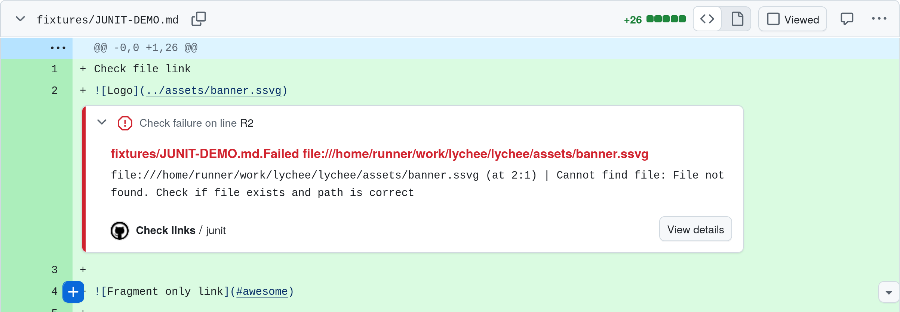

import CodeBlock from "../../../components/code.astro";
import { Aside } from "@astrojs/starlight/components";

## Basic example

This recipe demonstrates how to set up an automated workflow
that will check all repository links on push.

```yaml
name: Links

on:
  push:

jobs:
  linkChecker:
    runs-on: ubuntu-latest
    steps:
      - uses: actions/checkout@v5
      - name: Link Checker
        id: lychee
        uses: lycheeverse/lychee-action@v2
        with:
          format: "markdown"
          args: ". --verbose"
```

## Pull request comment

[sticky-pull-request-comment](https://github.com/marocchino/sticky-pull-request-comment)
is a practical way to display lychee's results on a pull request using a sticky comment.

```yaml
name: Check links

on:
  pull_request:
    types: [opened, synchronize, reopened]

jobs:
  check-links:
    runs-on: ubuntu-latest
    steps:
      - uses: actions/checkout@v5
      - uses: lycheeverse/lychee-action@v2
      - name: Comment broken links
        uses: marocchino/sticky-pull-request-comment@v2
        with:
          path: lychee/out.md
```

## Annotate link check errors

Using the `junit` format it's possible to output the link check results
as a [JUnit test report](https://github.com/testmoapp/junitxml).
As shown in the below screenshot, this output can then be used
to annotate link check failures directly in the code of a pull request
using [action-junit-report](https://github.com/mikepenz/action-junit-report).



```yaml
name: Check links
on:
  pull_request:

jobs:
  junit:
    runs-on: ubuntu-latest

    steps:
      - uses: actions/checkout@v4

      - name: Check links
        id: lychee
        uses: lycheeverse/lychee-action@v2
        with:
          fail: false # continue on failures
          format: "junit"
          output: "results.xml"

      - name: Publish link check report
        uses: mikepenz/action-junit-report@v6
        with:
          report_paths: "results.xml"
          annotate_only: true
          fail_on_failure: true # only fail in the end
```

## Caching

Caching is a great way to speed up your CI/CD pipeline and
to reduce the number of requests performed.
Caching is achieved by providing the `--cache` flag
and reusing the `.lycheecache` file between consecutive runs.
Below is an example workflow that caches lychee results.

```yaml
name: Check URLs with lychee

on:
  push:

jobs:
  linkChecker:
    runs-on: ubuntu-latest
    steps:
      # Cache lychee results (e.g. to avoid hitting rate limits)
      - name: Restore lychee cache
        uses: actions/cache@v4
        with:
          path: .lycheecache
          key: cache-lychee-${{ github.sha }}
          restore-keys: cache-lychee-

      - uses: actions/checkout@v5

      - name: lychee URL checker
        uses: lycheeverse/lychee-action@v2
        with:
          # arguments with file types to check
          args: >-
            --cache
            --verbose
            --no-progress
            './**/*.md'
            './**/*.html'
        env:
          # to be used in case rate limits are surpassed
          GITHUB_TOKEN: ${{secrets.GITHUB_TOKEN}}
```

This pipeline will automatically cache the results of the lychee run.
Note that the cache will only be created if the run was successful.
If you need more control over when caches are restored and saved, you can split
the cache step and e.g. ensure to always save the cache (also when the link
check step fails):

```yaml
- name: Restore lychee cache
  id: restore-cache
  uses: actions/cache/restore@v3
  with:
    path: .lycheecache
    key: cache-lychee-${{ github.sha }}
    restore-keys: cache-lychee-

- name: Run lychee
  uses: lycheeverse/lychee-action@v2
  with:
    args: "--cache --max-cache-age 1d ."

- name: Save lychee cache
  uses: actions/cache/save@v3
  if: always()
  with:
    path: .lycheecache
    key: ${{ steps.restore-cache.outputs.cache-primary-key }}
```

## Fixing broken links with archived versions

[David Gardiner](https://david.gardiner.net.au/) wrote a series of blog posts
about how he used lychee-action to replace broken links on his website with
archived versions. The posts are a great example of how to use lychee-action
together with other actions to achieve a specific goal. Thanks David for the
great write-up!

To achieve this, David used the [Wayback Machine Query Github Action](https://github.com/marketplace/actions/wayback-machine-query) to query
for archived versions of broken websites. The results of the query were then fed
into the [Replace multiple strings in files action](https://github.com/marketplace/actions/replace-multiple-strings-in-files)
to update the files.

Here are the links to the blog posts which explain the process in more detail:

- [Fixing my blog (part 2) - Broken links](https://david.gardiner.net.au/2022/04/blog-fix-part2.html)
- [Fixing my blog (part 3) - Querying the Wayback Machine](https://david.gardiner.net.au/2022/04/blog-fix-part3.html)
- [Fixing my blog (part 4) - Updating the files](https://david.gardiner.net.au/2022/04/blog-fix-part4.html)
