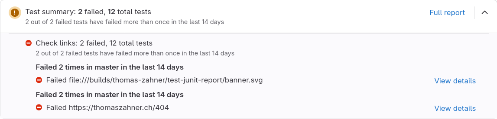

import CodeBlock from "../../../components/code.astro";
import { Aside } from "@astrojs/starlight/components";

## Basic example

This recipe demonstrates how to set up a CI job to check links in a repository.
GitLab integrates nicely with the JUnit XML report format.
This makes it easy to visualise link check results as test reports,
as shown in the below screenshot.



```yaml
Check links:
  stage: test
  script:
    - apt-get update -qq && apt-get install -y -qq wget
    # recommended to pin a stable version such as "lychee-v0.24.0"
    - version="nightly"
    - wget -qO- "https://github.com/lycheeverse/lychee/releases/download/$version/lychee-x86_64-unknown-linux-gnu.tar.gz" | tar -xz
    - ./lychee --verbose --include-mail --format junit --output results.xml TEST.md
  artifacts:
    when: always
    reports:
      junit: results.xml
```
